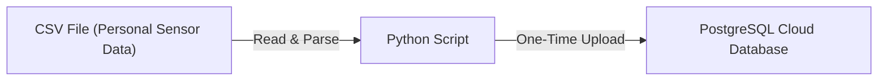
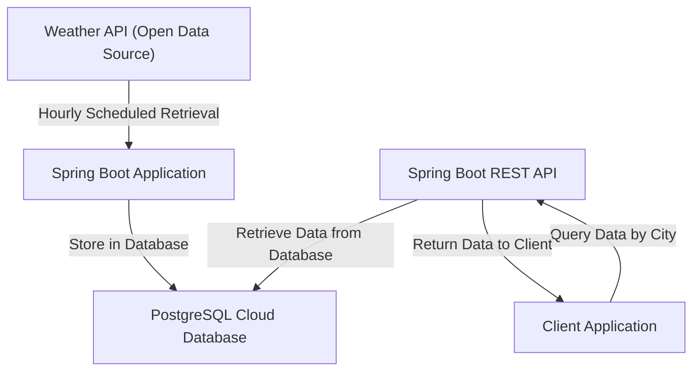

### Assignment 3: Sensor Data Gathering

**Name**: Zhaocun Sun
**Student Number**: 24343278

---

#### 1. Introduction

This project demonstrates the process of gathering, storing, and providing access to both personal and open-source sensor data on cloud infrastructure. Task 1 involves a one-time data transfer to a PostgreSQL cloud database, while Task 2 implements real-time data updates from an open-source API, stored on the same database and accessible via a Spring Boot API.

---

#### 2. Task 1 - One-Time Transfer of Personal Data

For Task 1, I uploaded a personal dataset from a CSV file containing environmental sensor metrics to a PostgreSQL cloud database in a one-time transfer.

##### Data Source and Processing

- **Data Source**: The CSV file included various environmental metrics, such as air quality and noise levels, from a previous assignment.
- **Data Transfer Process**: A Python script read and validated each entry from the CSV file before uploading it to the PostgreSQL database. As this task required only a single upload, the data was transferred in bulk, rather than in real time.

##### Cloud Storage Setup

- **Database**: PostgreSQL, hosted on a cloud server to provide remote access.
- **Schema**: The database schema was designed with columns for sensor serial number, data type, timestamp, data values (stored as JSON for flexibility), and an outlier flag.
- **One-Time Upload**: After parsing, the data was uploaded in one batch to the cloud database, ensuring consistency in data format and type.

##### Task 1 Technical Diagram

The following diagram illustrates the one-time transfer of data from the CSV file to the PostgreSQL cloud database:

##### Task 1 Results

The CSV data is now accessible in the cloud database, ready for future application use. Data integrity was confirmed by verifying the entries in the database after upload.

---

#### 3. Task 2 - Real-Time Gathering of Open Data

Task 2 involved integrating open-source environmental data from a weather API in real-time. The data is retrieved hourly and stored in the PostgreSQL database, providing ongoing updates.

##### Data Source and Real-Time Collection

- **Data Source**: A weather API providing metrics such as air quality, temperature, humidity, and dominant pollutants for various cities.
- **Real-Time Retrieval with Scheduled Tasks**: Using the `@Scheduled` annotation in Spring Boot, the application retrieves data every hour. This ensures that the data remains current, simulating real-time collection.

##### Cloud Storage and API Access

1. **Database Integration**: The retrieved data is stored in a PostgreSQL table named `air_quality_data`, which includes fields for city, AQI, temperature, humidity, and timestamp.
2. **Spring Boot REST API**: A REST endpoint (`/api/airquality/{city}`) was created to allow clients to query data by city. This endpoint, defined in `AirQualityController`, returns data in JSON format.
3. **Continuous Cloud Operation**: The Spring Boot application is deployed on a cloud server, running persistently to handle hourly data updates and respond to client requests in real time.

##### Task 2 Technical Diagram

The following diagram depicts the flow of data from the weather API to the PostgreSQL database, including the real-time data retrieval and client access via the REST API:

##### Task 2 Results

The real-time data collection functions as intended, with the Spring Boot application successfully performing hourly updates to the PostgreSQL database. The REST API endpoint provides reliable access to the latest data, meeting the requirements for real-time data integration and client availability.

---

#### 4. Technical Summary

The following table provides an overview of the technologies and their roles in this project:

| Technology      | Role                                                         |
| --------------- | ------------------------------------------------------------ |
| **PostgreSQL**  | Cloud database for storing personal and open-source data     |
| **Python**      | One-time data transfer from CSV to PostgreSQL                |
| **Spring Boot** | Manages real-time data retrieval, storage, and client API access |
| **REST API**    | Provides client access to real-time data by city             |
| **@Scheduled**  | Schedules hourly data collection from the weather API        |

---

#### 5. Plagiarism and Code Reuse

This assignment was completed individually, with reference to online resources where required. All referenced materials are cited in the source files, and no code was shared or reused inappropriately.

#### 6. Use of AI Tools

**Statement**: I did not make use of AI tools in the preparation of this assignment.